# [MySQL Shell ユーティリティを使ってみた](https://dev.mysql.com/doc/mysql-shell/8.0/ja/mysql-shell-utilities-dump-instance-schema.html)

## 機能概要

MySQLのバックアップ/リストアを実行できるユーティリティで、従来のmysqldumpと比較して並列スレッドで実行することにより、高速な論理バックアップ/リストアを行うことができます。また、テーブルのデータは自動的に圧縮されるため、リダイレクトして圧縮コマンドを使うことなくストレージ領域の節約が可能です。

## install

### Microsoft Windows への MySQL Shell のインストール

MSI インストーラを使用して Microsoft Windows に MySQL Shell をインストールする。次の手順を実行する。

#### 1. download

http://dev.mysql.com/downloads/shell/ からWindows (x86、64-bit)、MSI インストーラパッケージをダウンロードする。

(1) 「Windows (x86, 64-bit), MSI Installer」の「download」ボタンをクリックする

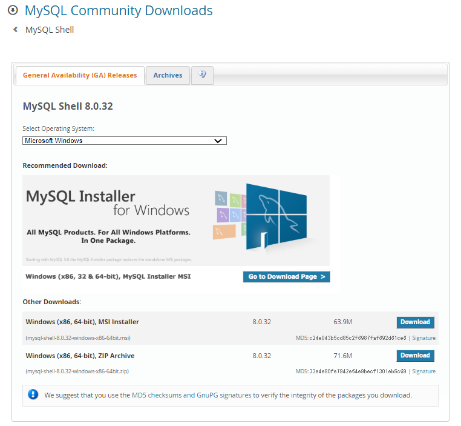

(2) 「No Thanks, just start my download」をクリックする

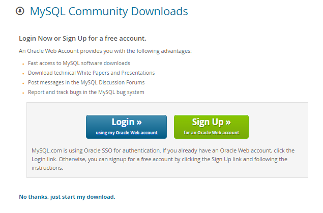

#### 2. install

(1) 「Next」をクリック

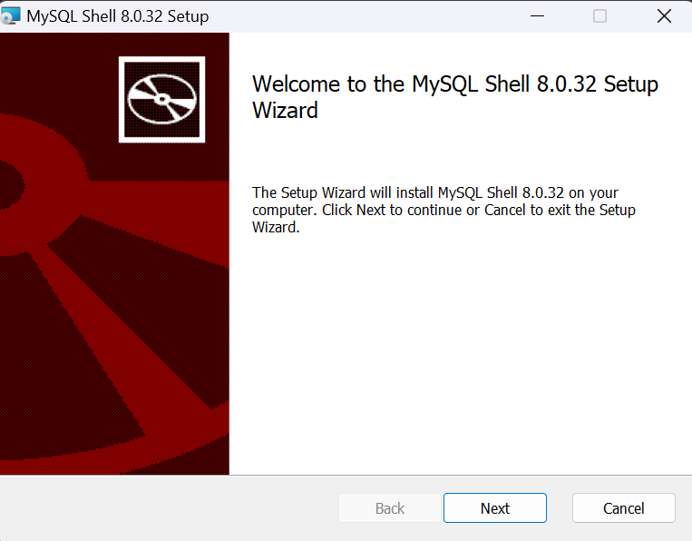

(2) 「I accect the terms in the License Agreement」をチェックして「Next」をクリック

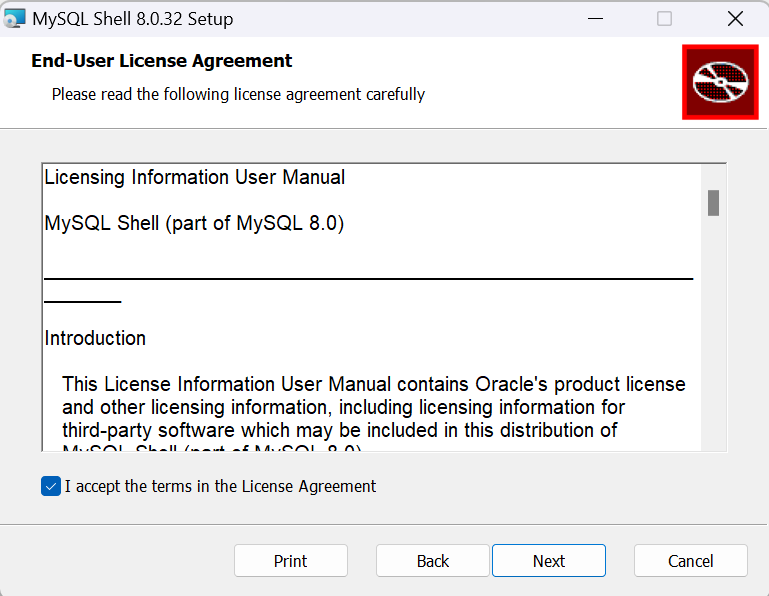

(3) 「Next」をクリック

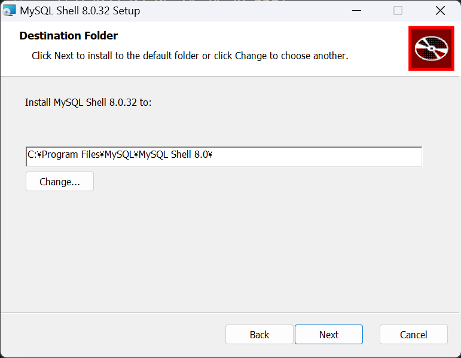

(4) 「Install」をクリック

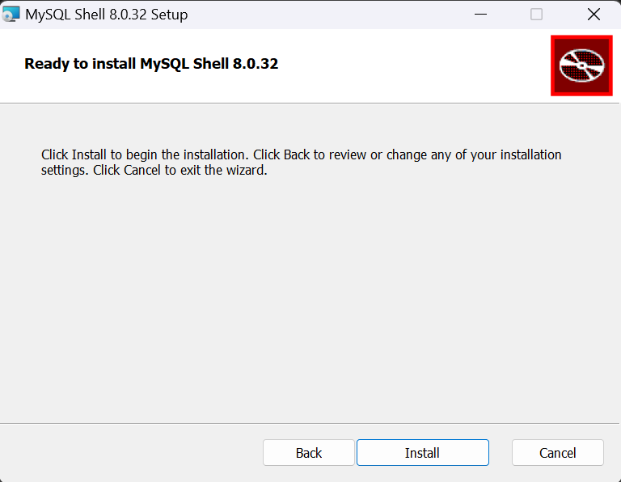

(5) インストール中

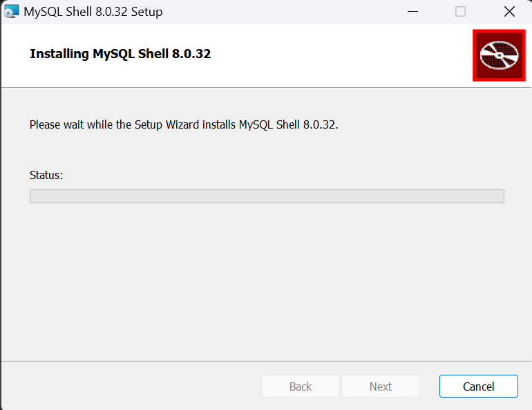

(5) 「Finish」をクリックしてインストール完了

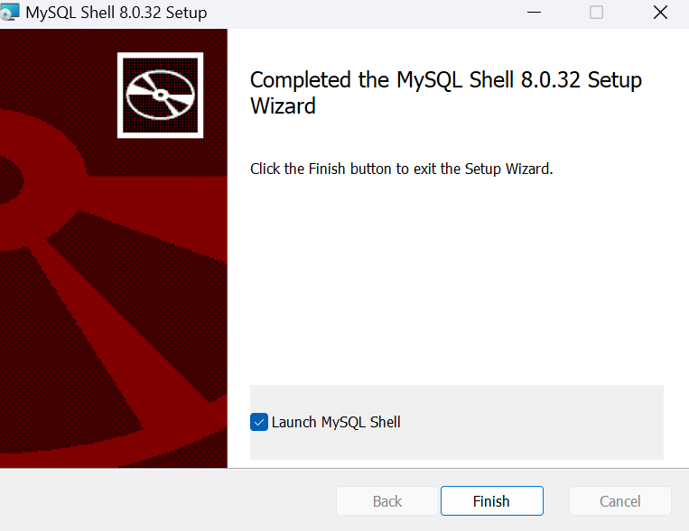

## 使い方

コマンドプロンプトを開いて以下のコマンドを実行してmysqlshellにログインします。
ユーザーには権限が必要です。

```shell:command
mysqlsh -h hostname -u username -p
```

実行例：

```shell:command
mysqlsh -h localhost -u testuser -p
MySQL  localhost:33060+ ssl  JS >
```

## ダンプユーティリティ

mysqlのダンプを取得することができます。mysqlshellにログインして以下のコマンドを実行します。

```shell:mysqlshell
# データベースをダンプする場合
> util.dumpInstance(outputUrl[, options]) 

# スキーマをダンプする場合
> util.dumpSchemas(schemas, outputUrl[, options])

# テーブルをダンプする場合
> util.dumpTables(schema, tables, outputUrl[, options])
```

ユーザーは、BACKUP_ADMIN, EVENT, RELOAD, SELECT, SHOW VIEW, and TRIGGER権限を持っている必要です。
outurlは出力先のディレクトリ名を指定します。

詳しい説明については[公式サイト](https://dev.mysql.com/doc/mysql-shell/8.0/ja/mysql-shell-utilities-dump-instance-schema.html)などを参考にしてください。


## ダンプロードユーティリティ

ダンプユーティリティでダウンロードしたダンプをMySQLにロードします。

```shell:mysqlshell
util.loadDump(url[, options])
```

詳しい説明については[公式サイト](https://dev.mysql.com/doc/mysql-shell/8.0/ja/mysql-shell-utilities-load-dump.html)


## 例 MySQLのスキーマをダンプして別のスキーマにロードする

例として、localhostのtestdbをダンプして、testdb5にロードする例をやってみます。

|機能  |ホスト名|スキーマ名|
|:----|:----|:----|
|ダンプ(移行元)|localhost|testdb|
|ロード(移行先)|localhost|testdb5|

testdbには以下のようになっています。

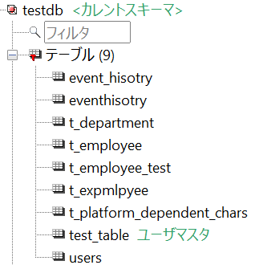

それでは移行していきます。

1. あらかじめMySQLにスキーマを作成しておきます。

```sql
create schema testdb5
```

2. MySQL Shellにログインして、dumpSchemasを実行します。

```shell:mysqlshell
> mysqlsh -h localhost -u testuser -p
MySQL >util.dumpSchemas(["testdb"], "C:/temp/dbdump/testdb")
```

ダウンロードしたデータは以下のようになります。※一部です

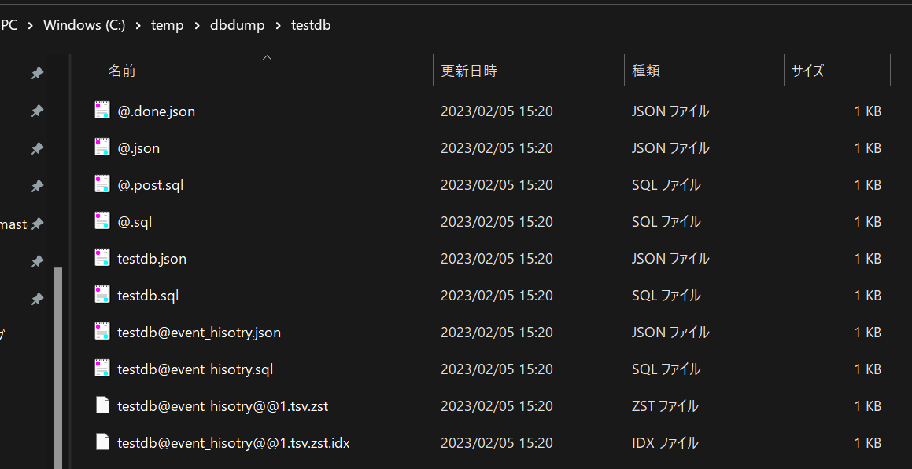


3. MySQL Shellにログインして、loadDumpを実行します。


```shell:mysqlshell
> mysqlsh -h localhost -u testuser -p
MySQL >util.loadDump("C:/temp/dbdump/testdb", {showProgress: true, schema: "testdb5"})
```

結果は以下の通りです。

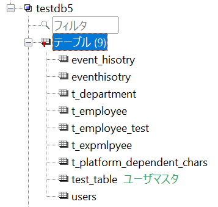


